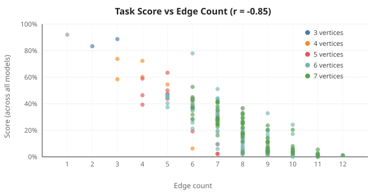
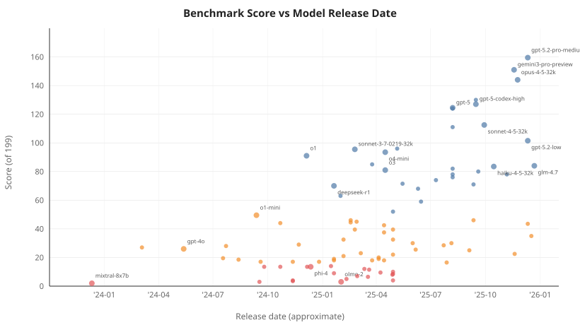

# PlanarBench

### Evaluating LLM Spatial Reasoning via Planar Graph Drawing

Oleksandr Nikitin <oleksandr@tvori.info>

> PlanarBench tests whether LLMs can draw planar graphs as ASCII art given only an edge list -- a spatial reasoning task that resists memorization because edge order, edge orientation, and node labels are all permutable.  
> 
> We evaluate 91 models on the 199 simplest non-isomorphic connected planar graphs (2 - 7 vertices).  
> 
> Edge count is the dominant difficulty predictor ($r = -0.85$) -- a finding not reported in prior LLM graph benchmarks, which use only node count as the difficulty axis.





To install dependencies:

```bash
bun install
```

To run:

```bash
bun run scenarios/run-scenario.ts gemma3 200 [parallel] [item]
```

Force re-run specific task

```bash
ONE=44 scenarios/run-scenario.ts gemma3
```

internal meta: `graph-bench-as1073`, `p52`
